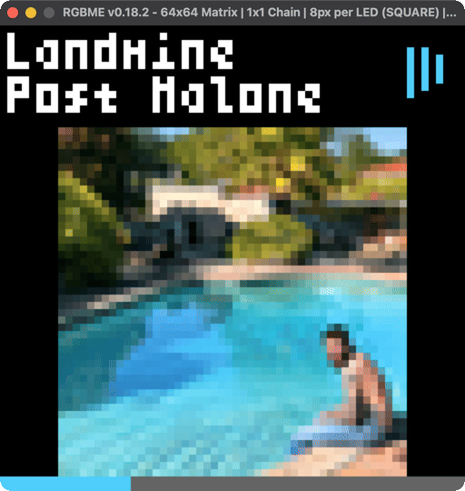
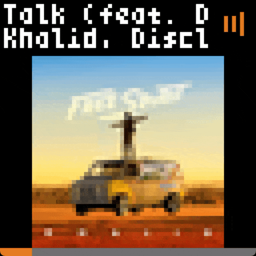

<div align="center">
  
  <h1>rpi-spotify-matrix-display</h1>
  <p>A Spotify display for 64x64 RGB LED matrices.<br>Run on a Raspberry Pi connected to a matrix, or just play around using the emulator!</p>
  <a href="https://www.buymeacoffee.com/kylejohnsonkj"></a>
</div>

## 🔑 Spotify Setup
1. Go to the [Spotify Developer Dashboard](https://developer.spotify.com/dashboard)
2. Create a new app _(name/description can be anything)_
3. Add http://127.0.0.1:8080/callback to Redirect URIs
4. Save and copy the Client ID and Secret for later

## 📦 Installation

```bash
git clone https://github.com/kylejohnsonkj/rpi-spotify-matrix-display

cd rpi-spotify-matrix-display

make          # The Makefile does it all for you!
```

## ▶ Running the Display

```bash
make emulate  # Run in emulator (macOS, Windows, etc. - no external hardware required)
make run      # Run on a pi connected to an LED matrix display

make help     # List available commands
```

After starting the display, follow the instructions in the console. The pasted link should begin with http://127.0.0.1:8080/callback. After successful authorization, play a song and the display will appear! ✅

---

## 🎵 Lyrics Support

The display supports two methods of displaying lyrics. You can choose your preference by setting `dedicated_lyrics` to true or false in the configuration file.

| Standard Lyrics (default) | Dedicated Lyrics |
| --- | --- |
|  |  |

## 🧩 Configuration

You can configure the display using the `config.ini`. Use it to update your [hardware mapping](https://github.com/hzeller/rpi-rgb-led-matrix#changing-parameters-via-command-line-flags) (may be required), opt for fullscreen artwork, adjust timings, or permit only certain playback devices to activate the display.

## 💬 FAQ

<details>
<summary><b>Can I use this with a matrix other than 64x64?</b></summary>

Only 64x64 matrices are supported at this time. If you'd like to extend this project to support other matrix sizes, feel free to fork this project!
</details>

<details>
<summary><b>I'm not seeing the right album artwork.</b></summary>

Spotify is likely set to video playback mode and is sending a still from the video. Switch back to audio playback in your Spotify app.
</details>

<details>
<summary><b>Where do I get my `sp_dc` for lyrics?</b></summary>

[See this guide](https://github.com/akashrchandran/syrics/wiki/Finding-sp_dc) to find your sp_dc cookie. Skip this step if you do not want to show lyrics.
</details>

<details>
<summary><b>Why are lyrics sometimes delayed or out of sync?</b></summary>

When playing to a Spotify Connect destination, lyrics may start out delayed due to the API not accounting for how long the destination took to connect. This is automatically resolved after about 30s of listening, when the API figures out what happened. You can see the same behavior with Spotify's own lyrics screen as well. Additionally, some songs are synced better than others.
</details>

<details>
<summary><b>Why does the API get called every second?</b></summary>

Spotify's API does not provide public websocket support, so the only way to determine playback status and track progression is by polling the API regularly. You can increase this polling interval in `config.ini` if you want to reduce the number of calls.

Note that using the `device_whitelist` requires an additional request every 5 seconds to check for active devices. This is disabled by default.
</details>

---

## 🛠️ Building Your Own Display

Don't have a Raspberry Pi or LED matrix yet? No worries! Play around with the emulator and come back to this section once you're ready.

**Parts List**

- [Adafruit 64x64 RGB LED Matrix - 2.5mm Pitch - 1/32 Scan](https://www.adafruit.com/product/3649)
- [Adafruit RGB Matrix Bonnet for Raspberry Pi](https://www.adafruit.com/product/3211)
- [Raspberry Pi 3B+](https://www.raspberrypi.com/products/raspberry-pi-3-model-b-plus/) (or newer)
- Any microSD card
- [5V 10A Power Supply Adapter](https://www.amazon.com/gp/product/B08HCS1X66)

I also 3d printed a [matrix stand](https://www.thingiverse.com/thing:3781875) and a [pi mount](https://www.thingiverse.com/thing:2732552) for my [own build](https://imgur.com/a/64x64-album-art-matrix-backside-AjrOa5e).

Once you have all the parts, proceed with the Rasperry Pi Setup below!

<details>
<summary><b>⚙️ Raspberry Pi Setup</b></summary>

#### Step 1: Install Pi OS
- [Download and open the Raspberry Pi Imager](https://www.raspberrypi.com/software/)
    - Select your Raspberry Pi
    - Select `Raspberry Pi OS (other) - Raspberry Pi OS Lite (64-bit)`
    - Select your microSD card
- Tap "Next" and edit OS customization settings
    - Set hostname (I put matrix), set user/pass (I kept user as pi)
    - Enter wifi credentials
    - Enable ssh using password authentication
- When done, insert microSD card in pi and wait a few min for boot up

#### Step 2: Login via ssh
- `ssh pi@matrix.local`
- This puts you in the `/home/pi` directory
- You can use `pwd` to confirm where you are throughout this process

#### Step 3: Install git
- `sudo apt install git`

#### Step 4: Follow the [Installation](#-installation) guide
- Soon you'll be seeing something like this!

https://github.com/user-attachments/assets/9bf163f9-8e0f-47cc-b2d2-a62b3a975471

</details>

---

## :heart: Acknowledgements
- **allenslab** for inspiring this project with the original [matrix-dashboard](https://www.reddit.com/r/3Dprinting/comments/ujyy4g/i_designed_and_3d_printed_a_led_matrix_dashboard/)
- **typorter** for his continued work on [RGBMatrixEmulator](https://github.com/ty-porter/RGBMatrixEmulator)
- **hzeller** for the [rpi-rgb-led-matrix](https://github.com/hzeller/rpi-rgb-led-matrix) library